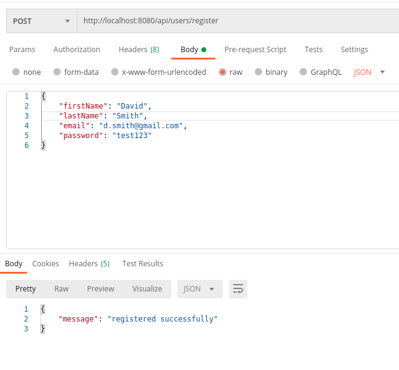
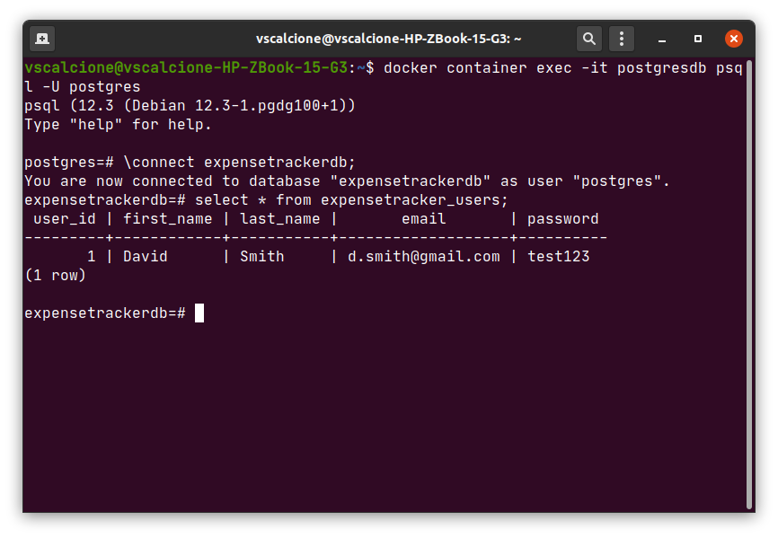

## springboot-restapi-postgresql-expensetracker


This is REST API application developed in Java with Spring Boot Framework.
For the testing of APIs, you can use <b>Postman, Insomnia</b>, all free softwares that can tests all HTTP Methods on this 
REST API

### Initialization (Docker-container's startup)
Install <b>docker</b> and <b>docker-compose</b> on your machine </li>
<br>

You can visit https://docs.docker.com/get-docker/ for documentation of your OS's install setup
<br>

Run this command on your shell for download locally postresql's container
```bash
$ docker container run --name postgresql -e POSTGRES_PASSWORD=admin -d -p 5432:5432 postgres
```

### Create PostgreSQL database
Now, clone the repository with command:
```bash
$ git clone https://github.com/vscalcione/springboot-restapi-postgresql-expensetracker.git
$ cd springboot-restapi-postgresql-expensetracker/src/main/resources
$ docker cp create_db.sql postgresdb:/
$ docker container exec -it postgresdb bash
$ psql -U postgres --file create_db.sql
```

### Add user


For verify the executed query, type this command on the bash like in picture:
```bash
$ docker container exec -it postgresdb psql -U postgres
$ \connect expensetrackerdb;
$ select * from expensetracker_users;
```


